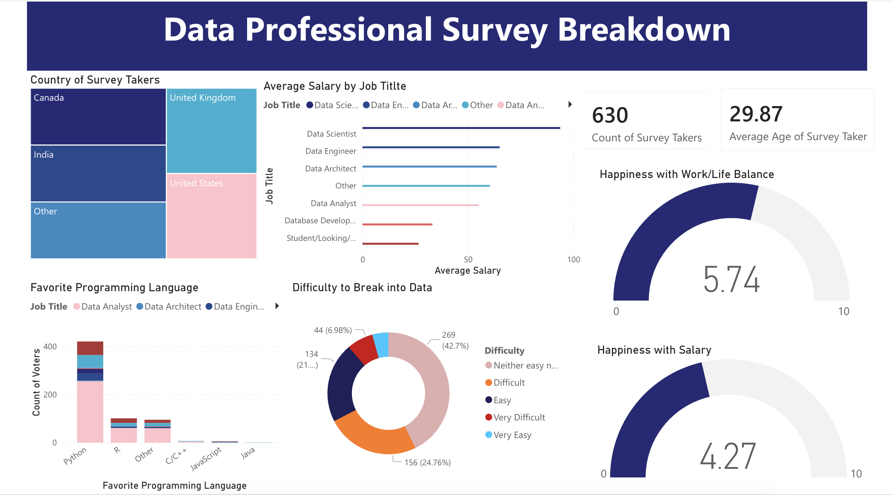

# PowerBI-Data-Professional-Survey
Interactive dashboard analyzing survey data from data professionals (Salary, Work-Life Balance, etc.)
# 📊 Data Professional Survey Breakdown (Power BI)

## Project Overview
This project visualizes the results of a survey taken by **630+ data professionals** to uncover trends in salaries, work-life balance, and tool preferences. Using **Power BI**, I transformed raw survey data into an interactive dashboard that provides a snapshot of the current data job market.

**Author:** Yichen Wang
**Guided By:** Alex The Analyst (Data Analytics Bootcamp)

## 📊 Dashboard Preview

*(Note: Please make sure the screenshot filename matches exactly!)*

## 🛠️ Process & Workflow

### 1. Data Cleaning & Transformation (Power Query)
* **Data Standardization**: Standardized messy **Job Title** and **Programming Language** columns by using delimiter splitting to group "Other" responses into main categories.
* **Custom Logic (DAX/M)**: Created a new `Average Salary` column by parsing the text-based salary ranges (e.g., "106k-125k") into numeric values and calculating the mean.
* **Data Modeling**: Removed irrelevant columns (Browser, OS) and validated data types to ensure accurate calculations.

### 2. Analysis & Visualization
* **Salary Trends**: Analyzed `Average Salary` by Job Title and Gender to identify industry benchmarks.
* **Demographics**: Utilized **Treemaps** to visualize the geographic distribution of survey takers.
* **Satisfaction Metrics**: Implemented **Gauge Charts** to display average ratings (0-10) for Work/Life Balance and Salary Satisfaction.
* **Tool Popularity**: Ranked favorite programming languages (Python, R, SQL) using clustered bar charts.

## 🔎 Key Insights
* **Salary**: Data Scientists reported the highest average salary ($113k), followed by Data Engineers.
* **Language**: Python is the most popular language among Data Scientists, while SQL usage is consistent across all roles.
* **Work-Life Balance**: The average work-life balance rating was 5.7/10, suggesting room for improvement in the industry.

## 📂 File Info
* `Data Professional Survey.pbix`: The complete Power BI project file.
* `dashboard_screenshot.png`: A static preview of the dashboard.
* `Data_Professional_Survey_Dataset.csv`: Raw survey data source.

## 🤝 Acknowledgements
This project was completed as part of a self-guided learning journey through the **Data Analyst Bootcamp** by **Alex The Analyst**. 

* **Guided By**: [Alex The Analyst](https://www.youtube.com/@AlexTheAnalyst)
* **Project Context**: Power BI Portfolio Project
